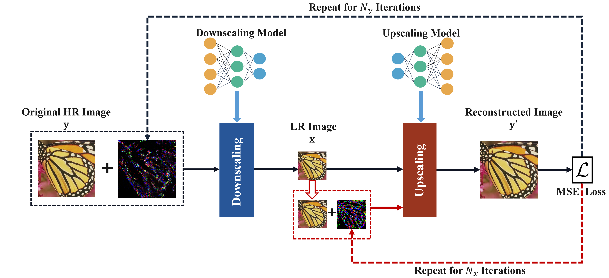

# HCD-IRN (Invertible Image Rescaling)
Pytorch implementation for "Downscaled Representation Matters: Improving Image Rescaling with Collaborative Downscaled Images".

## Requirements
- PyTorch >= 1.0
- Python >= 3.6
- NVIDIA GPU + CUDA

## Inference for image rescaling
We have put some images into the folder `/codes/dataset`, put the configuration file in the folder `/codes/options/test`, and put the pre-trained model in `/codes/experiments/pretrained_models`. You can run the following command directly without any changes:
```
cd codes
python my_train.py -opt /options/test/test_IRN_x2.yml
```

If the test image is too large, you can split the image into multiple patches, and run:
```
cd codes
python my_train_patch.py -opt /options/test/test_IRN_x2.yml
```

## Architecture of HCD


## Acknowledgement
The code is based on [IRN](https://github.com/pkuxmq/Invertible-Image-Rescaling), and the pretrained model comes from [IRN](https://github.com/pkuxmq/Invertible-Image-Rescaling).
